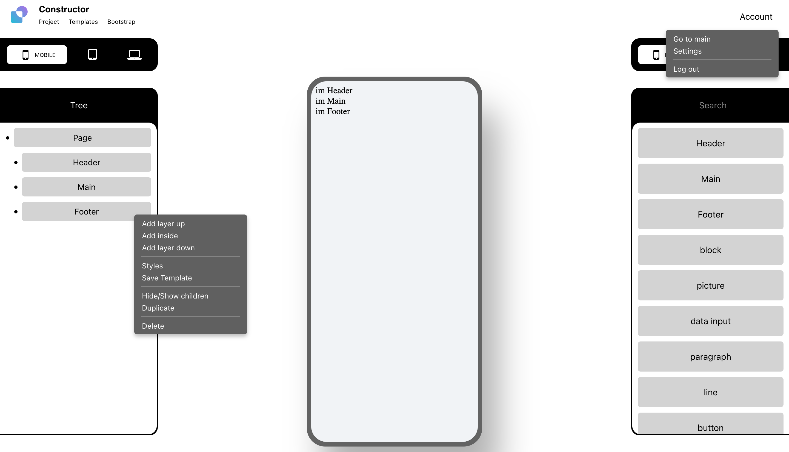
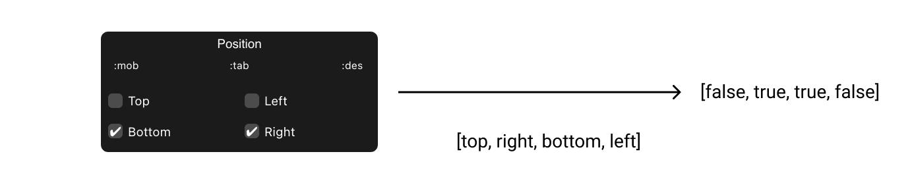

# It should be simple site-builder which allows creating simple pages for projects

My site builder supports styles from Bootstrap and Materialize.
You can create your own Templates or use default from style-frameworks.
User can create full page with or without style-frameworks.
Its like figma, but you create fully working HTML-page.

# How it looks when Bootstrap added

# Style Cards 
Should be used to create custom CSS Styles.
## WidthCard

## HeightCard

## FlexCard

## BackgroundColorCard

## MarginCard

## PaddingCard

## BoxShadowCard

## FontCard

## BorderCard

## BorderColorCard

## BorderRadiusCard

## PositionCard

## TransitionCard

## ObjectFitCard
